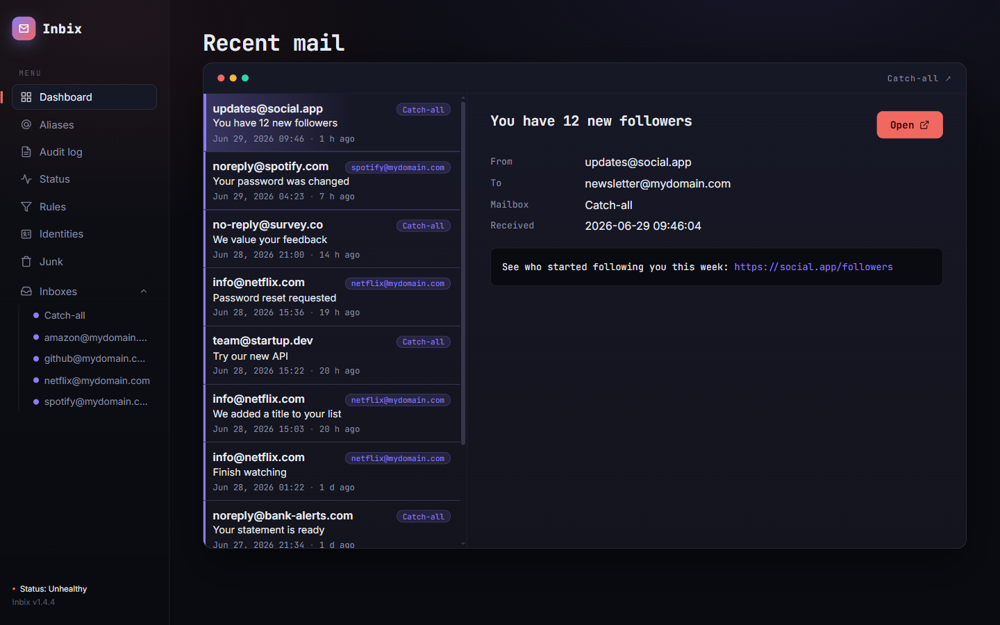
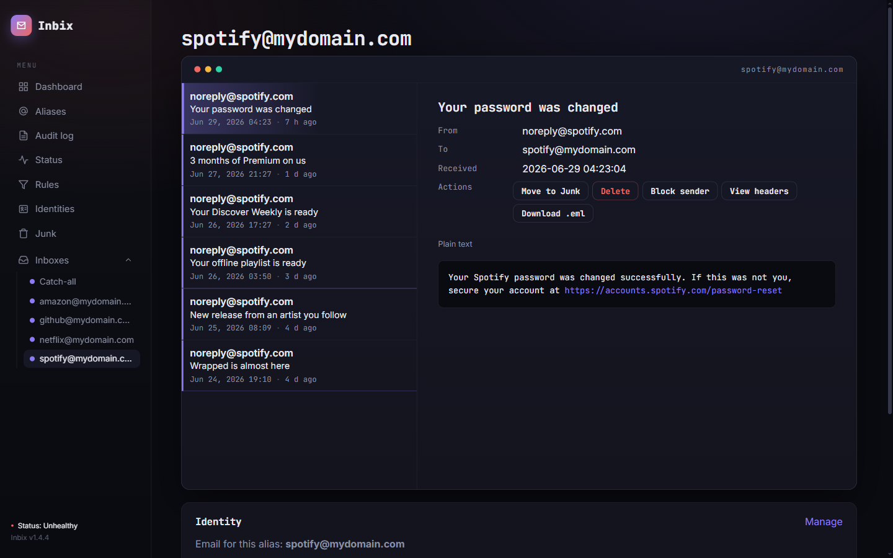
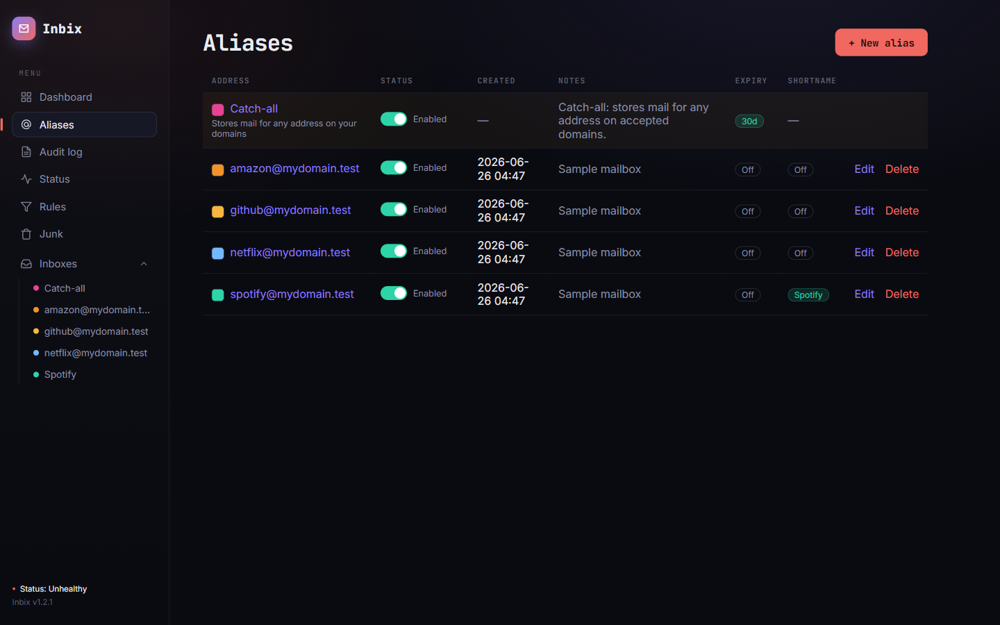
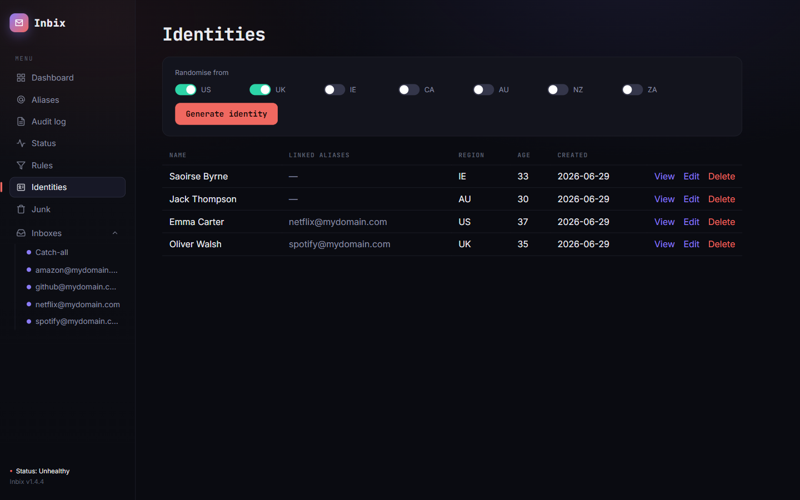
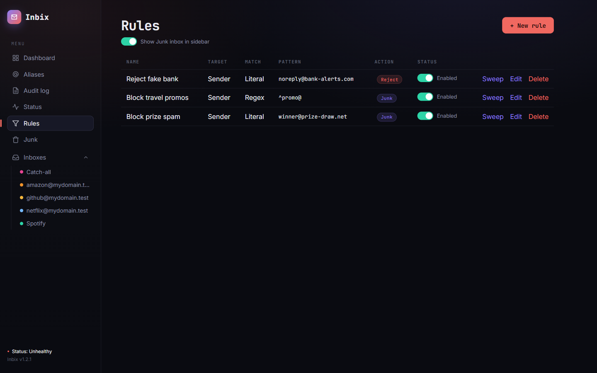
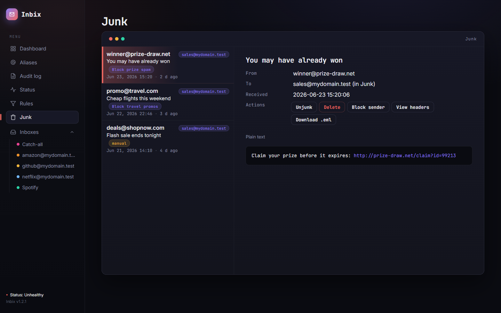
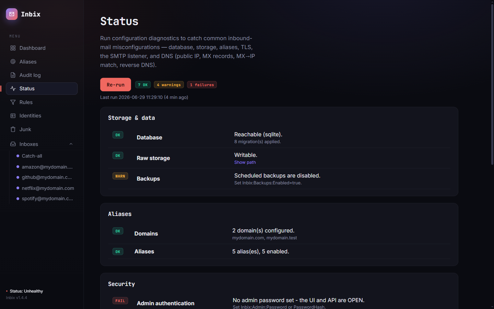

# Inbix

**Use a different email address for every account you register — infinite emails, and protection when breaches and leaks occur.**

Inbix is a self-hosted, inbound-only **alias mail server** built for signing up to websites. Point your
domain at it and you get **effectively unlimited email addresses**: hand each service its own —
`spotify@mydomain.com`, `github@mydomain.com`, `tiktok@mydomain.com` — with no inbox to create per alias.

The point is to shrink your blast radius. Today most people reuse one email everywhere, so when a website
is breached and its database leaks (or it wasn't trustworthy to begin with), that single address turns up in public
dumps and ties all your accounts together — ready for credential-stuffing and targeted phishing. With
Inbix, every site only ever knows a unique, single-purpose address. A leak exposes *that one* alias and
nothing else: you can see exactly who leaked it, blacklist or disable it in one click, and the rest of
your accounts stay unlinkable. Pair each alias with a saved registration **identity** — a distinct
username, password and profile per site — and a breach of one account gives an attacker no foothold on any
other.

Inbix receives real mail over SMTP, accepts only the aliases you've defined (or a catch-all), stores each
message in full, and serves it back through a fast read-only web UI and API. Note that Inbix cannot send email, so bear that in mind for accounts you take seriously and may eventually need to send mail from. It's also not designed to be permanent storage for your email — it's built for signups, disposable mail, password resets, 2FA codes and confirmation messages. It also has a blocklist: when an address gets burned you can block it, and any further mail to it gets a "550 mailbox unavailable" reply. Spammers are punished for sending to unavailable mailboxes, so they're incentivized to drop the address from their lists — giving you a chance to stop the endless deluge of spam without "deleting" your email account.

> Built entirely in C# on ASP.NET Core / .NET 10. Runs as a Windows Service or in Docker.

---

## Screenshots

| | |
|:--:|:--:|
| Recent-mail dashboard | Mailbox — message + linked identity |
|  |  |
| Aliases — color, shortname, expiry &amp; linked identity | Identities — offline profiles linked to aliases |
|  |  |
| Rules — sender/recipient blacklisting | Junk inbox — rule-tagged, with manual overrides |
|  |  |
| Status — configuration &amp; DNS diagnostics | |
|  | |

> Screenshots use the built-in sample data (`Inbix:SeedSampleData=true`).

---

## Features

- Custom SMTP receiver (port 25) built on the [`SmtpServer`](https://github.com/cosullivan/SmtpServer) library,
  behind a replaceable `InboundMessage` boundary so the SMTP layer can be swapped for Postfix later.
- Alias validation at `RCPT TO`: unknown/disabled recipients are rejected with `550`.
- Fast SMTP transaction → raw MIME stored immediately → MIME parsed asynchronously by a background worker.
- Two interchangeable storage backends (`Inbix:Database:Provider`): **`sqlite`** via Dapper with a
  version-manifest migration runner, or a **`json` file/folder store** that tolerates network filesystems
  (atomic per-file writes) — see [Storage providers](#storage-providers). The data layer is abstracted
  behind repository interfaces, so callers don't change.
- Raw MIME and attachments are stored on disk (keeps the database small; parsing can be re-run from source).
- Blazor admin UI + JSON API (dashboard, aliases, inbox, message viewer with sandboxed HTML, audit log).
- **Identities**: generate fake registration identities offline for major English-speaking countries
  (US, UK, Ireland, Canada, Australia, NZ, South Africa) — username, password, address, DOB, phone,
  security Q&A — and link one to an alias to keep that email's sign-up details together.

## Architecture

```
Internet sender ──SMTP:25──▶ Inbix.Smtp (SmtpServer)
                                   │  validate RCPT TO (Inbix.Data alias resolver)
                                   ▼
                            IInboundMessageSink  ── raw MIME ──▶ disk (Inbix.Data raw store)
                                   │                              metadata ──▶ SQLite
                                   ▼
                            Inbix.Worker (MimeKit) parses headers/body/attachments asynchronously
                                   ▼
                            Inbix.Web  ── Blazor UI + /api (read-only) ──▶ you
```

| Project | Responsibility |
|---|---|
| `Inbix.Core` | Domain models, the `InboundMessage` boundary, options, abstractions, alias rules |
| `Inbix.Data` | Dapper repositories, SQLite connection factory, migration runner, raw store, inbound sink |
| `Inbix.Smtp` | `SmtpServer` integration: alias mailbox filter + message store |
| `Inbix.Worker` | Background MIME parser (MimeKit) |
| `Inbix.Web` | ASP.NET Core host: API, Blazor UI, hosted services, Windows Service support |
| `Inbix.Tests` | xUnit tests (alias rules, MIME parsing, data round-trip on real SQLite) |

## Running locally

```bash
dotnet run --project src/Inbix.Web
```

- Web UI/API: http://localhost:5080
- SMTP: port **2525** in Development (port 25 in Production). Set `Inbix:Domains` to a domain you’ll test with.

Send a test message with any SMTP client, e.g. swaks:

```bash
swaks --to spotify@mydomain.test --server localhost:2525 --body "hello inbix"
```

(First create the `spotify` alias in the UI or via `POST /api/aliases`.)

## Configuration

All settings live under the `Inbix` configuration section and are overridable by environment variables
using the `__` separator (e.g. `Inbix__Smtp__Port=2525`).

| Key | Default | Description |
|---|---|---|
| `Inbix:Domains` | `["mydomain.com"]` | Domains accepted for delivery |
| `Inbix:Database:Provider` | `sqlite` | Storage provider: `sqlite` (embedded SQL) or `json` (file/folder store — see below) |
| `Inbix:Database:ConnectionString` | `Data Source=./data/inbix.db` | ADO.NET connection string (SQLite only; ignored for `json`) |
| `Inbix:Database:MigrateOnStartup` | `true` | Apply pending migrations at startup (SQLite only) |
| `Inbix:Database:JournalMode` | `WAL` | SQLite `journal_mode`. `WAL` (default; works on NFS via exclusive locking) or `DELETE` for a rollback journal |
| `Inbix:Database:PooledConnections` | `false` | Default `false` = a single exclusive connection, safe on a **network filesystem (NFS/SMB)**. Set `true` for pooled connection concurrency on **local disk only** — see [SETUP.md](SETUP.md#8-suggestions--tips) |
| `Inbix:Storage:JsonPath` | `./data/store` | Root of the JSON file/folder store (when `Provider=json`) |
| `Inbix:Storage:WriteRetrySeconds` | `5` | How long a JSON file write/move is retried on transient IO errors (NFS resilience) |
| `Inbix:Smtp:Port` | `25` | SMTP listen port |
| `Inbix:Smtp:ServerName` | `inbix` | EHLO/banner name |
| `Inbix:Smtp:MaxMessageSizeBytes` | `26214400` | Max accepted message size (else `552`) |
| `Inbix:Smtp:MaxConcurrentSessions` | `50` | Concurrent-session cap (rejected at MAIL FROM); 0 disables |
| `Inbix:Smtp:MaxConnectionsPerMinutePerIp` | `0` | Per-IP connection rate limit/min; 0 disables |
| `Inbix:Smtp:CertificatePath` / `CertificatePassword` | _(empty)_ | PFX path to enable STARTTLS |
| `Inbix:Imap:Enabled` | `false` | Read-only IMAP server (see [Read mail in a client](#read-mail-in-a-client-imap)). **Internal networks only.** |
| `Inbix:Imap:Port` | `143` | IMAP listen port |
| `Inbix:Imap:Username` / `Password` | `admin` / `admin` | IMAP login, **separate from the admin login** (or set `Inbix:Imap:PasswordHash`) |
| `Inbix:Imap:CertificatePath` / `CertificatePassword` | _(empty)_ | PFX path to serve IMAP over TLS (else plaintext) |
| `Inbix:Imap:AllowDelete` | `false` | When on, deleting in a mail client **permanently deletes** the message from Inbix. Off = read-only. |
| `Inbix:Storage:RawPath` | `./data/raw` | Directory for raw MIME + attachments |
| `Inbix:DataProtectionKeysPath` | _(empty)_ | Where to persist DataProtection keys (cookie signing); set to keep logins across restarts |
| `Inbix:Worker:PollSeconds` / `BatchSize` | `5` / `20` | Parser poll interval / batch size |
| `Inbix:Backups:Enabled` | `false` | Enable scheduled database backups |
| `Inbix:Backups:Directory` | `./data/backups` | Where backup files are written |
| `Inbix:Backups:IntervalHours` / `RetentionCount` | `24` / `7` | Backup cadence / how many to keep |
| `Inbix:RequireHttps` | `false` | HTTP→HTTPS redirect, HSTS, forwarded-proto, Secure cookie |
| `Inbix:SeedSampleData` | `false` | On an empty DB, seed demo mailboxes + messages (and enable catch-all). On by default in Development |
| `Inbix:Diagnostics:PublicIpLookupUrl` | `https://checkip.amazonaws.com` | Public-IP probe for the status page; empty to disable |
| `Inbix:Diagnostics:IntervalHours` | `6` | Background diagnostics cadence (runs ~5s after startup, then every N hours); 0 = startup only |
| `Inbix:Junk:RetentionDays` | `30` | Days a message stays in Junk before the cleanup job deletes it |
| `Inbix:Junk:CleanupIntervalHours` | `24` | Hours between Junk cleanup runs; 0 = run only at startup |
| `Inbix:Admin:Username` | `admin` | Admin login username |
| `Inbix:Admin:Password` | _(empty)_ | Admin password (plaintext; prefer `PasswordHash`) |
| `Inbix:Admin:PasswordHash` | _(empty)_ | PBKDF2 hash (preferred); see below |
| `Inbix:Admin:ApiKey` | _(empty)_ | Optional key for `/api` via `X-Api-Key` header |

## Authentication

The admin UI is protected by cookie login; `/api` accepts **either** the login cookie **or** an
`X-Api-Key` header. Authentication turns on as soon as a password is configured:

- Set `Inbix:Admin:Password` (quick) or `Inbix:Admin:PasswordHash` (preferred).
- Generate a hash: `dotnet run --project src/Inbix.Web -- hash-password "your-password"`,
  then set the printed value as `Inbix:Admin:PasswordHash`.

> ⚠️ If **no** password/hash is set, authentication is **disabled** and the UI/API are open — a
> startup warning is logged. Always set a password before exposing Inbix.

Put the UI behind HTTPS in production: set `Inbix:RequireHttps=true` (or terminate TLS at a reverse
proxy and keep it on a private network / VPN).

## API

```
GET    /api/aliases
POST   /api/aliases                 { "localPart": "spotify", "domain": null, "notes": null }
GET    /api/aliases/{id}
PATCH  /api/aliases/{id}            { "enabled": false, "notes": "..." }
POST   /api/aliases/{id}/identity   { "identityId": 42 }           (null to unlink)
GET    /api/aliases/{id}/messages
GET    /api/identities
POST   /api/identities              { "country": "uk", "firstName": "...", "username": "...", ... }
POST   /api/identities/generate     { "countries": ["us","au"] }   (draft; omit to use saved default)
GET    /api/identities/{id}
GET    /api/identities/by-alias/{aliasId}
PATCH  /api/identities/{id}
DELETE /api/identities/{id}
GET    /api/messages/{id}
GET    /api/messages/{id}/raw       (downloads .eml)
GET    /api/messages/{id}/attachments
GET    /api/attachments/{id}/content
GET    /api/audit
GET    /api/diagnostics            (same checks as the Status page, as JSON)
GET    /api/backups
POST   /api/backups
```

OpenAPI document is served at `/openapi/v1.json` in Development.

## Health checks

Two unauthenticated endpoints for monitors / orchestrators:

| Endpoint | Meaning |
|---|---|
| `GET /health` | Liveness — the process is up (runs no checks). |
| `GET /health/ready` | Readiness — returns 503 unless the database is reachable. |

The Docker image has a `HEALTHCHECK` that polls `/health/ready`.

## Status / diagnostics page

The **Status** page (`/status`) runs configuration diagnostics to catch common inbound-mail
misconfigurations. They run automatically a few seconds after startup and then every
`Inbix:Diagnostics:IntervalHours` (default 6), and can be re-run on demand from the page. The
sidebar footer shows a live rollup (Healthy / Warnings / Issues) linking here. Checks:

- Database reachable + migrations applied; raw storage writable; backups present/fresh.
- Domains configured; at least one enabled alias.
- Admin password set; HTTPS enabled; STARTTLS certificate valid / expiry.
- SMTP listener accepting connections (locally).
- **DNS:** public IP (via `Inbix:Diagnostics:PublicIpLookupUrl`), MX records per domain, whether the
  primary MX host resolves to this server's public IP, and reverse DNS (PTR) for the public IP.

DNS lookups use [DnsClient.NET](https://github.com/MichaCo/DnsClient.NET) (Apache-2.0). Set
`Inbix:Diagnostics:PublicIpLookupUrl` to empty to skip the outbound public-IP probe.

## Rules (blacklist) & Junk

The **Rules** page (`/rules`) blocks unwanted mail by **sender** or **recipient**, matched as a
literal string or a **regex**. Each rule chooses an action:

- **Reject** — refuse at SMTP `RCPT TO` with 550 ("no inbox exists"); nothing is stored.
- **Discard** — accept (250) then silently drop.
- **Junk** — accept (250) and file into the hidden **Junk** inbox, tagged with the matching rule.

Rules apply to new mail within ~30 seconds. **Sweep** applies a rule to *existing* mail — it first
shows a preview (count + sample with links to open the full messages), then on confirm moves the
matches into Junk. Deleting a rule offers an **unsweep** to restore the mail it junked.

The **Junk** inbox is hidden from the sidebar until you enable it with the toggle on the Rules page.
You can manually move any message to Junk (or unjunk it) from the message view; a manual action locks
the message so rule sweeps leave it alone (shown with a "manual" tag). Junked mail is auto-deleted
after `Inbix:Junk:RetentionDays` (default 30) by a daily job.

Quick shortcuts: the message view has **Block sender / Block recipient** buttons (pre-filling a new
rule), and deleting an alias offers to block future mail to that address.

### Per-mailbox expiry

Every alias and the catch-all can auto-delete old mail (off by default, 60 days). Configure it per
mailbox on the **Aliases** page. Retention is measured from a message's **last state change**
(junk/unjunk/sweep/unsweep) or, if it was never moved, its received date. Enabling expiry shows a
warning with the count and a preview of the mail that will be deleted (recycling the Sweep preview).
The same daily job that prunes Junk (`Inbix:Junk:CleanupIntervalHours`) applies these expiries.

## Identities

The **Identities** page (`/identities`) generates believable, **offline** sign-up identities (no
external service) so you have consistent fake details for each registration — and can retrieve them
later. Tick the **countries** to randomise from — US, UK, Ireland, Canada, Australia, New Zealand,
South Africa (US + UK by default, and your choice is saved) — then **Generate**: full name, a
dictionary-word username (e.g. `golden_chase92`), a strong password, a country-appropriate address and
phone, adult date of birth, and a security question/answer. Edit any field (with per-field re-roll for
username/password) and **Save**.

Linking is done from an **alias's inbox** (the "Identity" panel): generate-and-link a fresh identity or
link an existing one. **A single identity can be linked to many aliases** — reuse one persona across
several sign-ups — while each alias has at most one identity (shown on its inbox with copy buttons, the
password masked behind a reveal toggle). Deleting an identity unlinks its aliases but keeps the aliases;
the Identities page lists which aliases use each identity. Identities — including passwords — are stored
in the database in clear text so they can be retrieved, so treat the database and backups as secrets
(see [Security notes](#security-notes)).

## Read mail in a client (IMAP)

Inbix can expose a **read-only IMAP server** so a mail client (Thunderbird, Apple Mail, K-9, …) can browse
stored mail. It's **disabled by default** and has its **own login, separate from the admin account**
(default `admin` / `admin`).

> ⚠️ **Internal networks only.** IMAP gives read access to *all* stored mail, and credentials are sent in
> **plaintext** unless you set `Inbix:Imap:CertificatePath`. Do **not** expose it to the internet — bind it
> to a LAN/VPN address and firewall it. The Status page flags a weak/default password and this exposure.

Enable it:

```bash
Inbix__Imap__Enabled=true
Inbix__Imap__Username=you
Inbix__Imap__Password='a-strong-passphrase'      # or Inbix__Imap__PasswordHash=$(… hash-password …)
# optional TLS: Inbix__Imap__CertificatePath=/path/to/cert.pfx
```

Then point a client at the host on port **143** (no encryption, or STARTTLS-less TLS if a cert is set),
username/password as above. Folders you'll see:

| Folder | Contents |
|---|---|
| `INBOX` | all non-junk mail across every alias |
| `Aliases/<address>` | one folder per alias (catch-all is `Aliases/catch-all`) |
| `Junk` | junked mail |

It's **read-only** by design (Inbix is inbound-only): you can read, search and download messages, but not
move, flag or send, and **deleting in the client does nothing on the server**. New mail appears live via
IMAP `IDLE`. If you'd rather manage mail from the client, set **`Inbix:Imap:AllowDelete=true`** — then
deleting a message (or moving it to Trash) **permanently removes** it from Inbix (row + raw MIME +
attachments). It's off by default because it enables real data loss from a mail client.

## Storage providers

Inbix has two interchangeable storage backends, selected with `Inbix:Database:Provider`:

| | `sqlite` (default) | `json` |
|---|---|---|
| Storage | one SQLite database file | a folder tree of JSON files |
| Querying | real SQL via Dapper | in-memory index (loaded once at startup) |
| On a **network filesystem (NFS/SMB)** | works with the default exclusive locking, but a SQLite file on a share is inherently riskier | **best fit** — every write is an atomic temp-file + rename, so a crash damages at most one email, never the whole dataset |
| Backups | in-app hot snapshots (online backup API) | the files *are* the backup unit — snapshot the directory with filesystem tooling |

**JSON mode layout** (`Inbix:Storage:JsonPath`, default `./data/store`): each alias is a folder under
`mail/` (the catch-all is `catchall/`), each email is one JSON file inside it, and junked mail moves into
a top-level `junk/` folder. Settings, rules and identities are small JSON files; the audit log is
`audit.jsonl`. Because `catchall` and `junk` are reserved folder names, aliases can't use those local
parts. The store is **read into memory once at startup and written through on every change** — if you edit
files on disk (or restore a copy), use **Status → Reload from disk** (or `POST /api/admin/reload`) to
re-read without a restart. See [`docker-compose.json.yml`](docker-compose.json.yml) for an NFS-friendly
deployment.

## Backups & restore

Set `Inbix:Backups:Enabled=true` for scheduled backups (default: daily, keep 7). Each backup is a
**consistent hot snapshot** of the SQLite database taken via SQLite's online backup API — safe to run
while the server is live (WAL pages included). You can also trigger one on demand:

```bash
curl -X POST http://localhost:8080/api/backups -H "X-Api-Key: <key>"   # create now
curl       http://localhost:8080/api/backups -H "X-Api-Key: <key>"     # list
```

To **restore**, stop Inbix and replace the database file with a backup:

```bash
cp ./data/backups/inbix-YYYYMMDD-HHMMSS-<id>.db ./data/inbix.db   # remove inbix.db-wal/-shm if present
```

> Raw MIME and attachments live on disk under `Inbix:Storage:RawPath` (immutable once written).
> Include that directory in your filesystem backups so restored message rows still resolve to their
> source files. In Docker, both the DB and raw store are on the `inbix-data` volume.

## Docker

```bash
docker compose up -d --build
```

See [`docker-compose.yml`](docker-compose.yml) for the sample configuration.

**All persistent state lives under a single `/data` mount** — so one volume is the entire backup unit:

| Path | Contents |
|---|---|
| `/data/inbix.db` (+ `-wal`/`-shm`) | SQLite database (when `Provider=sqlite`) |
| `/data/store` | JSON file/folder store — one file per email (when `Provider=json`) |
| `/data/raw` | raw MIME messages and attachments |
| `/data/backups` | database backups (when enabled) |
| `/data/keys` | DataProtection keys (so logins survive container recreation) |

The image sets **all** of these paths (including `JsonPath=/data/store`) by default, so
`docker run -v inbix-data:/data …` is enough for either provider — mount the **whole** `/data`, not a
subfolder. If you ever mount only `/data/raw`, the index (DB or JSON store) lives in the container's
throw-away layer and is **lost on the next update**; the raw `.eml` files survive but the inbox goes
empty. To rebuild the inbox from surviving raw files, use **Status → Re-index from raw** (or
`POST /api/admin/reindex`): it re-creates entries for any raw message missing from the index (routing is
reconstructed from headers — mail whose original alias is gone lands in the catch-all).

### Releasing an image

`ci.yml` builds and tests on every push to `main` / PR. The Docker image is built and pushed to GHCR
only when you create a **version tag**:

```bash
git tag v1.0.0
git push origin v1.0.0
```

This publishes `ghcr.io/<owner>/<repo>` tagged `1.0.0`, `1.0`, `1`, `latest`, and the commit SHA.
You can also trigger it manually from the Actions tab (workflow_dispatch).

## Windows Service

Publish and register as a service:

```powershell
dotnet publish src/Inbix.Web -c Release -o C:\Inbix
New-Service -Name Inbix -BinaryPathName "C:\Inbix\Inbix.Web.exe" -StartupType Automatic
Start-Service Inbix
```

The host calls `UseWindowsService()`, so it runs correctly under the Windows Service Control Manager.

## DNS (Cloudflare, DNS-only)

```
MX    mydomain.com       -> mail.mydomain.com   (priority 10)
A/CNAME mail.mydomain.com -> your public IP / DDNS hostname   (gray cloud / DNS-only)
```

Port 25 must be reachable from the internet. **Verify your ISP allows inbound port 25 before relying on this.**

## Testing

```bash
dotnet test
```

## Security notes

- The admin UI uses cookie login and `/api` requires a cookie or `X-Api-Key` — but only once a
  password is configured (see [Authentication](#authentication)). Set one before exposing Inbix, and
  still prefer keeping it on a VPN / behind a reverse proxy.
- HTML email bodies are rendered inside a `sandbox`ed `<iframe>` to prevent script execution.
- This system can hold password-reset/account-recovery mail. Encrypt backups and restrict access.
- **Known advisory:** `SQLitePCLRaw.lib.e_sqlite3` 2.1.11 (transitive via `Microsoft.Data.Sqlite`) is flagged by
  GHSA-2m69-gcr7-jv3q. It is the latest published bundle; bump it once an upstream fix ships.

## License

Inbix is released under the [MIT License](LICENSE). All third-party dependencies are permissive
(MIT, Apache-2.0, public domain, or OFL fonts) and compatible with MIT distribution — see
[THIRD-PARTY-NOTICES.md](THIRD-PARTY-NOTICES.md). There are no copyleft (GPL/LGPL/MPL) dependencies.
